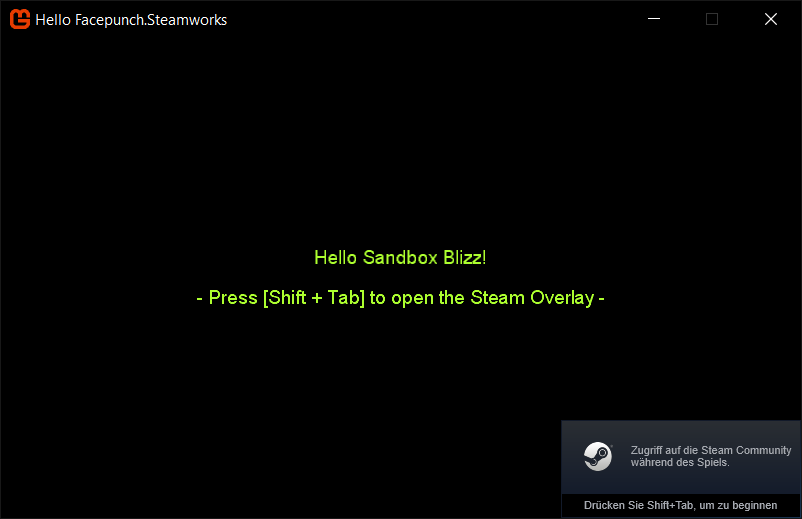
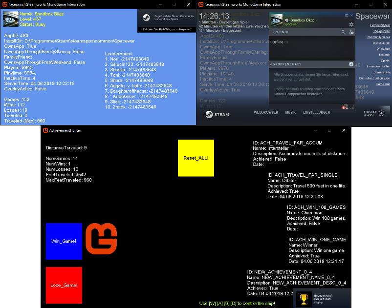

[](https://twitter.com/SandboxBlizz)

# Facepunch.Steamworks MonoGame Integration
Facepunch.Steamworks + MonoGame.Framework = the easiest SteamAPI Integration for your app!




### Building

The following is required to successfully compile the solution:

- 64 bit OS (no x86 support)
- .NET Framework 4.7.2
- [MonoGame.Framework.DesktopGL.Core 3.7.0.7](https://www.nuget.org/packages/MonoGame.Framework.DesktopGL.Core/) (included per nuget)
- [Facepunch.Steamworks](https://github.com/Facepunch/Facepunch.Steamworks) (modified source included)

### How To

To set up your own MonoGame with Facepunch.Steamworks integration project you need to do the following steps:

- Add the **Facepunch.Steamworks.dll** per [NuGet](https://www.nuget.org/packages/Facepunch.Steamworks/) or the included modified source
- Add **[steam_api64.dll](https://github.com/sqrMin1/Facepunch.Steamworks-MonoGame-Integration/tree/master/libs)** as a link to your project and set "copy to output directory" to "copy if newer"
- ~Add steam_appid.txt~ this step is not needed anymore!

- Initialize the API with the method **SteamClient.Init();** like this:

```cs
using Steamworks;

protected override void Initialize()
{
    try
    {
         SteamClient.Init(480);
         IsSteamRunning = true;
         SteamUtils.OverlayNotificationPosition = NotificationPosition.BottomRight;
    }
    catch (Exception e)
    {
        Console.Out.WriteLine(e.ToString());
    }
}
```

- Update callbacks with **SteamClient.RunCallbacks();** like this:

```cs
protected override void Update(GameTime gameTime)
{
    base.Update(gameTime);
    
    if (IsSteamRunning) SteamClient.RunCallbacks();
}
```

- ShutDown the Api with **SteamClient.Shutdown();** like this:

```cs
private void Game1_Exiting(object sender, EventArgs e)
{
    if (IsSteamRunning) SteamClient.Shutdown();
}
```

> Add the EventHandler **Exiting += Game1_Exiting** and then the SteamClient.Shutdown() method.

## Samples

The greatest thing about Facepunch.Steamworks is, that you can write code in native C#! 
Say bye bye to manual function calling and finally code like this again:

```cs
foreach ( var friend in SteamFriends.GetFriends() )
{
    Console.WriteLine( "{friend.Id}: {friend.Name}" );
    Console.WriteLine( "{friend.IsOnline} / {friend.SteamLevel}" );
    
    friend.SendMessage( "Hello Friend" );
}
```

```cs
public static async Task<Texture2D> GetUserImage(SteamId id, GraphicsDevice device)
{
    var image = await SteamFriends.GetMediumAvatarAsync(id);

    if (image.HasValue)
    {
        Texture2D avatarTexture = new Texture2D(device, (int)image.Value.Width, (int)image.Value.Height, false, SurfaceFormat.Color);
        avatarTexture.SetData(image.Value.Data, 0, image.Value.Data.Length);
        return avatarTexture;
    }
    else return null;
}

UserAvatar = GetUserImage(UserID, GraphicsDevice).Result;

```

More samples here:
https://github.com/Facepunch/Facepunch.Steamworks

### Included Sample Projects

- **Hello Facepunch.Steamworks**: Simple sample which sets up bare basics of the SteamAPI and displaying a welcome message which includes your steam user name.
- **AchievementHunter**: Simple sample which shows you the correct way of implementing achievements and stats as well as storing them on the steam server. It's based upon the Steamworks Example 'SpaceWar' included with the Steamworks SDK. 
- **Facepunch.Steamworks MonoGame Integration**: Extendend sample which shows some features of the SteamAPI like UserStats, PersonaState, LeaderboardData, NumberOfCurrentPlayers, Steam User Avatar and so on.
- **SteamInput**: Shows how to activate action sets from an ingame-actions-file (IGA) and receive digital and analog input data from the SteamApi. It is a MonoGame.Framework.DesktopGL project without the Microsoft.Xna.Framework.Input namespace.
- **[Workshop Tool](https://github.com/sqrMin1/Facepunch.Steamworks-MonoGame-Integration/tree/master/Documentation)**: Shows the bare basics of a Workshop like Querry Items, Creating Items, Uploading Items, Subscribing Items, Unsubscribing Items, Deleting Items and getting additional information about Items and the SteamRemoteStorage. Created with WindowsForms and pretty feature complete:


> Note: You need to start your steam client before executing the examples. Otherwise you won't receive any data -obviously ;)

**Have fun!**

[](https://twitter.com/SandboxBlizz)
